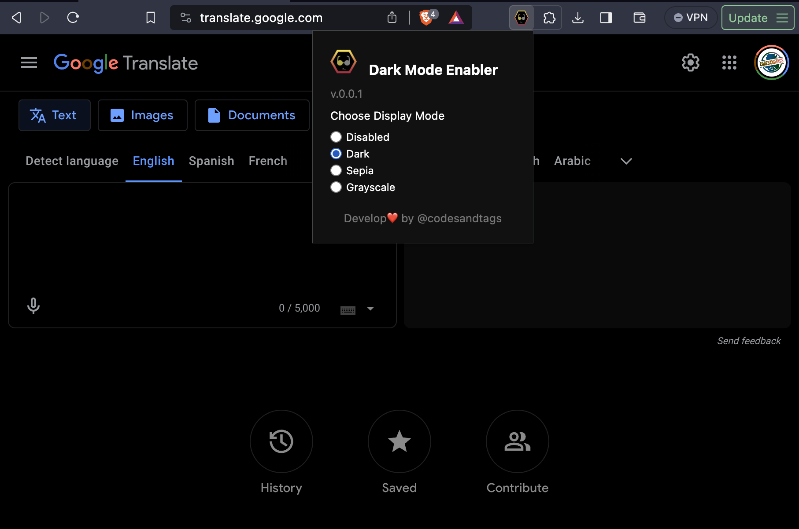

# Dark Mode Enabler Chrome Extension

## Introduction

Dark Mode Enabler is an open-source Chrome extension designed to help you enable Dark Mode or at least, invert colors to release your eyes from the white light of the screen.

## Examples

## Features

- Supports Dark Mode and Semi-Dark Mode.

## How to Use

1. Install the Dark Mode Enabler Chrome Extension from the Chrome Web Store.
2. Any website you want to enable Dark Mode, just click on the extension icon and it will invert the colors of the website.
3. Enjoy!

## Contributing

Dark Mode Enabler is an open-source project, and I welcome any contributions to enhance its functionality and usability. If you have any ideas for feature improvements or bug fixes, feel free to submit a pull request (PR). Together, we can make Dark Mode Enabler even better!

## Compatibility

At the moment, Dark Mode Enabler is compatible with any website that supports JavaScript.

## Disclaimer

Dark Mode Enabler is not affiliated with any website or company. It is an independent project created by Edwin Torres.

## License

Dark Mode Enabler is released under the [MIT License](https://en.wikipedia.org/wiki/MIT_License), which allows you to use, modify, and distribute the code freely. Please refer to the LICENSE file for more details.

## Contact

If you have any questions, suggestions, or feedback about Dark Mode Enabler, you can reach me via email at codesandtags@gmail.com or through GitHub's issue tracker.

Thank you for using Dark Mode Enabler!
